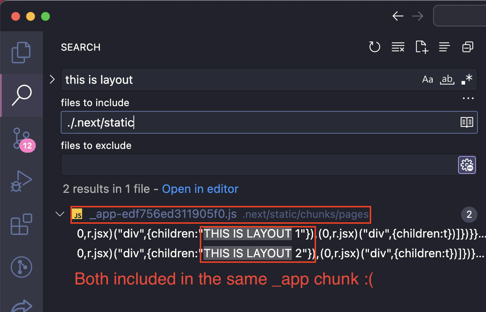
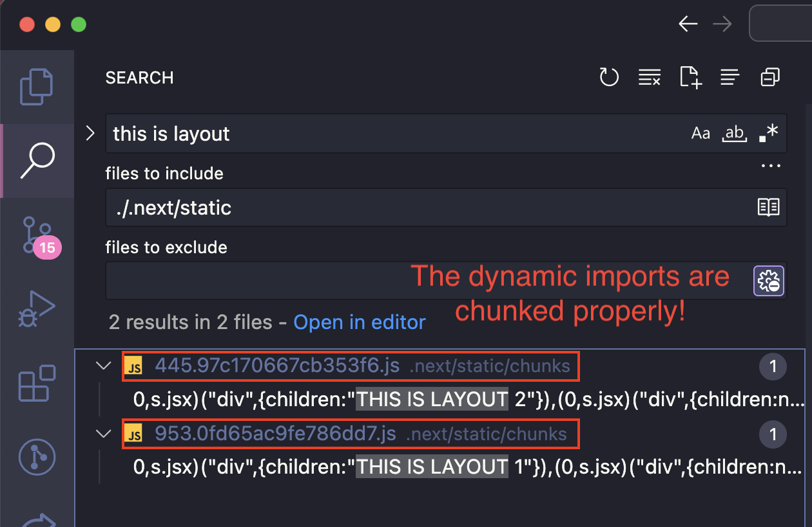

# Dynamic import + barrel file problem

Be careful with barrel files and dynamic imports!

## Problem

This is a problematic structure:

```
modules/
  layout/
    components/
      PageLayout.tsx
    layouts/
      index.ts
      Layout1.tsx
      Layout2.tsx
    index.ts (exposes PageLayout, Layout1, Layout2)
pages/
  _app.tsx (import PageLayout from `modules/layout` barrel)
  page-1.tsx
  page-2.tsx
```

`modules/layout/index.ts` is a barrel file that exports these for convenience:

```js
// modules/layout/index.ts
export { PageLayout } from './components/PageLayout';
export * from './layouts';
```

`_app.tsx` then accidentally imports from the barrel file (rather than `PageLayout` directly):

```js
// pages/_app.tsx
import { PageLayout } from '../modules/layout'; // oops!
```

The problem is that `modules/layout/index.ts` also imports the layout files themselves (`Layout1` and `Layout2`) since the barrel file is accessing them.

This causes both layouts to be bundled together in the app chunk (`.next/static/chunk/pages/_app-.....js`) and the dynamic imports are effectively rendered useless here 😱

`PageLayout` is supposed to defer loading each layout until they are actually needed, and split them out into their own separate chunks, to optimize the first load of the app. But with the barrel, it's not working:



## Solution(s):

- In `_app.tsx`, don't import from the barrel 🤦‍♀️ Re-evaluate if the barrel is even needed.

```js
// pages/_app.tsx
import { PageLayout } from '../modules/layout/components/PageLayout'; // much better!
```

- Or mark `{ "sideEffects": false }` inside the root package.json (ref: https://github.com/vercel/next.js/issues/27814)


